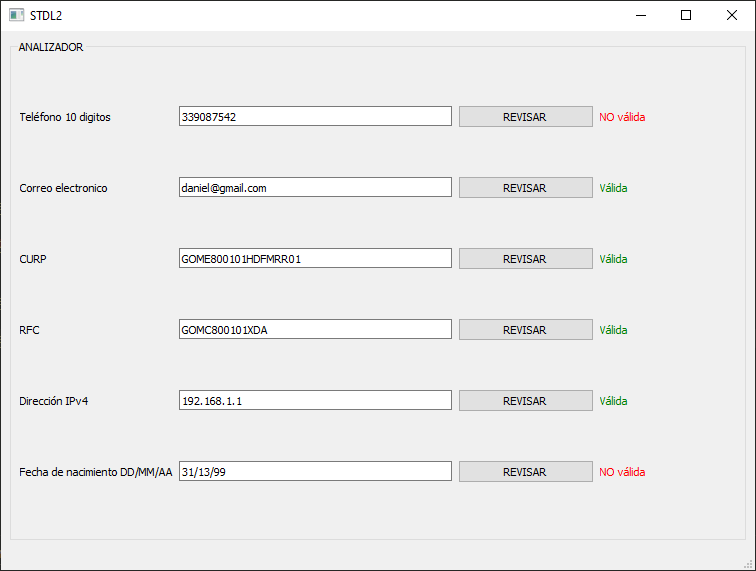
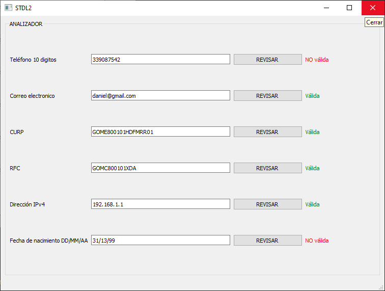
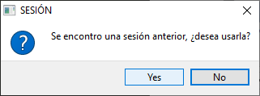
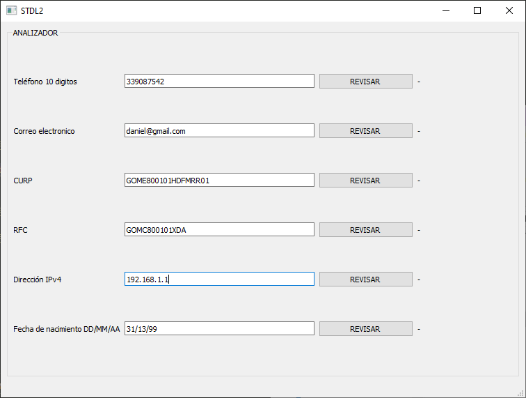
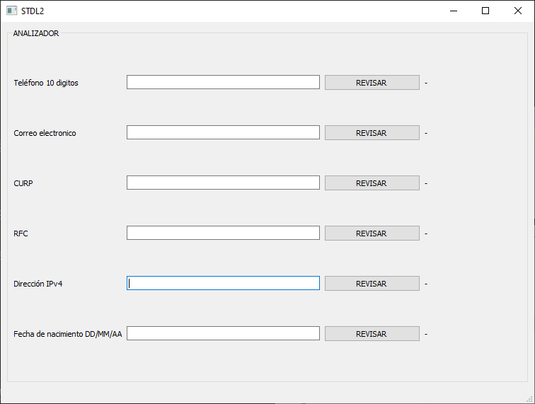

# CHECKPOINT

## DESCRIPTION

This is an app designed to analyze strings based on lexical analyzer principles. The main goal of this project is to implement a checkpoint system that allows users to restart their session if the app closes unexpectedly.

## EXAMPLE

### First time using the app

### Closing the app

### Choose if restart session
#### Question

### Answers:

#### YES

#### NO

